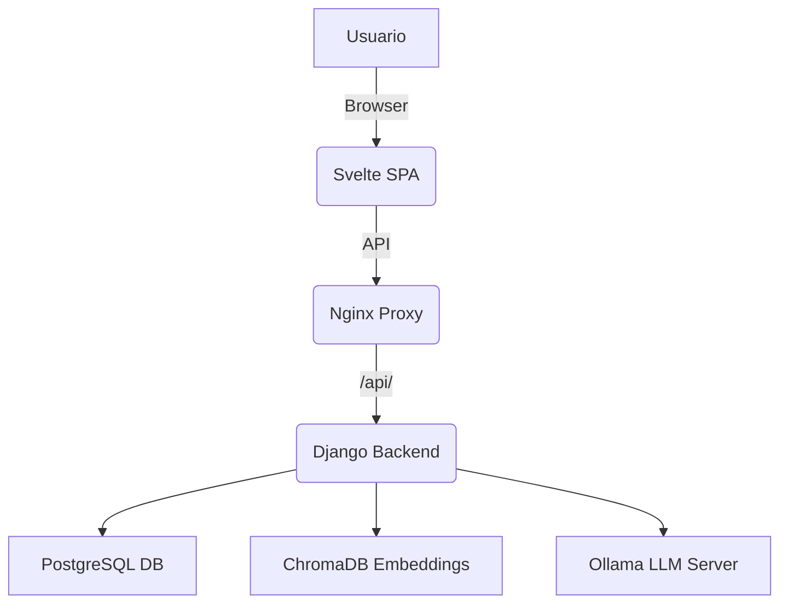

# 🧐 Mentor.IA

Mentor.IA es un sistema modular de planificación y ejecución de proyectos basado en agentes LLM interconectados. Funciona tanto online como offline y está construido sobre **Django**, **Svelte**, **Docker**, **Nginx**, **ChromaDB** y **Ollama**.

---

## 🔧 Estado actual

- ✅ **Frontend** SPA en Svelte + `vite` + `svelte-spa-router`.
- ✅ **Backend Django** con modelos `Objetivo`, `Roadmap`, `Tarea`.
- ✅ **Persistencia de datos** en PostgreSQL y ChromaDB.
- ✅ **Embeddings** locales usando `PersistentClient(path="chroma_db")`.
- ✅ **Infraestructura Docker** funcional.
- ✅ **Proxy Nginx** sirviendo frontend y backend.
- ✅ **Integración con Ollama** para generación LLM (`tinyllama`, `codellama`).
- ✅ **Routing SPA** corregido y validado.
- ✅ **APIs RESTful** para agentes: arquitecto, asistente, revisor.

---

## 💾 Estructura del proyecto

```
mentoria/
├── backend/            # Backend Django
│   ├── agentes/        # App de agentes inteligentes
│   ├── chroma_db/      # Base de datos local para embeddings
│   ├── mentoria/       # Configuración Django
│   └── manage.py
├── frontend/           # Frontend Svelte + SPA
│   └── src/routes/     # dashboard, planificador, vistas dinámicas
├── nginx/              # nginx.conf personalizado
├── docker-compose.yml  # Orquestación Docker
├── .env                # Variables de entorno
├── README_postman.md   # Documentación de la colección Postman
├── bitacora.md         # Registro de desarrollo
└── README.md           # (este documento)
```

---

## 🌐 Arquitectura general



---

## 📢 Endpoints disponibles

| Método | Endpoint                          | Descripción                                    |
|:--------|:----------------------------------|:-----------------------------------------------|
| POST    | `/api/arquitecto/crear_objetivo/` | Crear un nuevo objetivo y roadmap asociado    |
| POST    | `/api/asistente/checkin/`         | Validar progreso en tareas asignadas          |
| POST    | `/api/agentes/memoria/`            | Consultar documentos relevantes en ChromaDB   |
| POST    | `/api/agentes/historial/`          | Recuperar historial textual completo          |

*(Más detalles en `README_postman.md`)*

---

## 💡 Comandos útiles

```bash
# Build y despliegue completo
make force

# Solo frontend
make front-redeploy

# Acceso en navegador (local)
http://localhost/#/dashboard/planificar
```

---

## 🛠️ Requisitos

- Docker y Docker Compose
- Node.js (solo si desarrollas frontend fuera del contenedor)
- Archivo `.env` en la raíz:
  ```bash
  SECRET_KEY=changeme
  DEBUG=True
  USE_MOCK=False
  ```

---

## 🔄 Roadmap en desarrollo

- Visualización y edición de tareas en frontend
- Validación de planes y transición de fases
- Backup automático de embeddings y base de datos
- Sistema de timeline para roadmaps
- Refactor de `chroma_manager.py` para fallback seguro
- Mejora de UI/UX general en frontend

---

## 🤖 Filosofía del proyecto

Mentor.IA explora la **construcción colectiva**, la **gestión automatizada** y la **reflexión iterativa** mediante agentes inteligentes. Es un entorno modular, expandible y preparado para evolucionar en múltiples direcciones.

---

## 👥 Licencia

MIT License — Libre para usar, modificar y compartir.